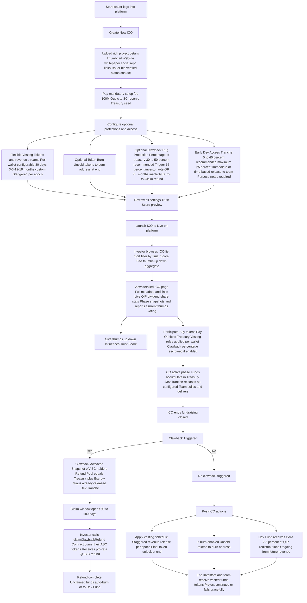

# QIP Upgrade Outline – Qubic ICO Portal v2

## Summary

This proposal enhances the Qubic ICO platform to boost investor protection, project quality, long-term commitment, transparency, and sustainable development funding — while remaining mostly permissionless and on-chain.

**Core Original Features (from initial outline):**
- Mandatory 1b Qubic ICO setup fee (seeds SC reserve)
- Permanent extra 2% dev fund slice from QIP redistributions
- ICO revenue distribution reduced to 3% 
- Flexible vesting for tokens & revenue (per-wallet configurable)
- Optional burn of unsold tokens
- Rich metadata, community thumbs voting, live stats, auto-calculated Trust Score

**New Developments (added refinements):**
- Centralized **per-ICO Treasury smart-contract** for all raised funds + revenue streams (enables clawback & dev access)
- **Optional Clawback / Rug-Pull Protection** with configurable percentage, triggers (vote or inactivity), and **burn-to-claim** refund mechanism (pro-rata QUBIC return after burning tokens — prevents double-dipping)
- **Early Development Access Tranche** (0–40%, recommended ≤25%) released immediately or time-based to give teams real runway without full lockup risk
- Clawback refunds exclude already-exited dev tranche funds
- Accelerated vesting on clawback trigger
- 90–180 day claim window for refunds; unclaimed auto-burn or to dev fund

These additions directly address key pain points: teams need funds to build deliverables, investors need enforceable safety nets against rugs, and the system must remain fair/on-chain.

## 1. Outline of Upgrades

### A. Mandatory ICO Setup Fee
- Issuer pays **1 Billion Qubic** when creating an ICO
- 10% Fee automatically seeds the smart-contract reserve
- 90% redistributed to SC holders

### B. Development Fund
- Add permanent **2%** slice allocated for dev fund
- reduce **5%** QIP redistributions for SC holders to **3%** 
- Flows to dedicated dev fund wallet for ongoing platform/protocol sustainability

### C. Treasury & Enhanced Vesting + Clawback + Dev Access
All raised funds and future revenue route through a **dedicated per-ICO Treasury smart-contract** (key architectural change enabling safety features).

#### 1. Flexible Vesting (per-wallet configurable)
- Applies separately to **tokens** and **revenue streams**
- Options: 30 days, 3/6/12/18 months, or custom
- Revenue: staggered per epoch (claimable); full unlock at end
- Tokens: unsold/remaining locked until final epoch
- Different rules per wallet (including issuer's)

#### 2. Optional Clawback / Rug-Pull Protection
- Issuer enables at launch (default = on); sets **Clawback %** (recommended 30–50%)
- Portion held in Clawback Escrow sub-wallet
- Triggers (chosen at launch):
  - Investor vote: 65% supermajority of token holders (window: first 12 months post-ICO)
  - Inactivity timeout: zero on-chain activity + no milestone proof for 6+ consecutive months
- On trigger: snapshot of current ABC holders → Refund Pool = remaining Treasury + Escrow (minus already-released dev tranche)
- **Burn-to-Claim Refund**: Investor calls `claimClawbackRefund()` → contract burns their ABC tokens → instant pro-rata QUBIC payout
- Vesting accelerates on clawback for fair claims
- Claim window: 90–180 days; unclaimed → auto-burn or to dev fund
- Massive Trust Score boost when enabled

#### 3. Early Development Access Tranche
- Issuer sets **0–40%** of funds/revenue (recommended max 25%)
- Released immediately or on simple time/milestone basis (e.g., 10% month 1, 15% month 3)
- Goes directly to project team wallet(s) for hiring/coding/marketing
- Optional: different % per participating wallet (e.g., big investors demand 0%)
- Every withdrawal requires short on-chain "purpose" note (transparency)
- These funds are **permanently non-refundable** even in clawback (solves "can't build = refund demands")

### D. Optional Token Burn
- At ICO end, unsold tokens sent to burn address (set at launch)
- Irreversible, on-chain visible

### E. UI/API/Metadata & Trust Score
- Rich fields: thumbnail, links (website/whitepaper/social/repo), issuer bio/verified/contact
- Live QIP dividend/share tracking, auto-reports/snapshots
- Community thumbs up/down voting (server-side aggregate)
- **Trust Score (0–100)** auto-calculated:
  - Clawback enabled + dev tranche ≤25% → strong positive
  - Clawback + reasonable dev access + milestone notes → top tier
  - Longer vesting / burn / good metadata / multiple revenue wallets → positive
  - Short vesting / missing details / high dev tranche / no clawback → negative
  - Community thumbs influence score

## 2. Full User Flow (Merged Original + New Features)

## Conclusion & Expected Impact

These features create a balanced, professional ICO ecosystem on Qubic:
- Serious projects get runway + credibility tools
- Investors gain real protections (clawback refund, trust signals)
- Platform gets sustainable funding
- Reduces rugs, improves capital efficiency, preserves decentralization

No major conflicting updates found in broader Qubic ecosystem news (2025–2026 roadmaps focus on network speed, feeless tx, mining integrations, decentralization incentives — nothing directly overrides or implements this ICO-specific proposal yet).

If you'd like to add pseudocode for the Treasury/Clawback logic, expand any section, or tweak the Mermaid further, just say! This is now a complete, evolved outline ready for your repo.