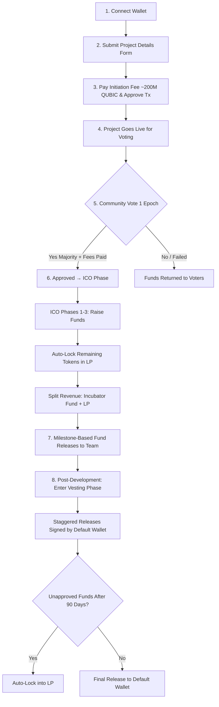

# QIP Upgrade + PORTAL(QSWAP) Integration

## Overview
We're upgrading the **Qubic ICO Portal (QIP)** and integrating it with **PORTAL (powered by QSWAP)** to create a unified, powerful launchpad called **Portal**.

**Goal**: Build a single, trusted ecosystem where developers of all levels can launch sustainable projects on Qubic — driving more liquidity, reducing dead projects, boosting long-term growth, and increasing trust across the network.

**Key Benefits**:
- Immediate LP creation post-ICO for real trading from day one
- Staggered / milestone-based fund releases to prevent rug pulls and pump-and-dumps
- Community validation through voting
- Lower barriers for new builders while supporting serious teams
- Sustainable tokenomics and development funding

## Why Integration Matters

### For Qubic Ecosystem & QSWAP
- Boost liquidity pools (LPs) — create them automatically after successful ICOs (using ICO funds to cover QX issuance + LP fees)
- Combat dead projects: Staggered releases keep teams accountable and active
- Future-proof against rising Qubic prices: Avoid unaffordable solo minting on QX
- Ensure projects stay updated with dedicated dev funding

### For QIP
- Generate consistent, high-quality ICO launches
- Establish a trusted incubation environment
- Add server API for richer project data and better UX
- Offer tiered launch options: direct QIP for advanced teams vs. community-backed PORTAL for beginners
- Secure long-term maintenance by onboarding official team support

## Core Objectives of Unified Portal
1. Community voting → Early project validation
2. Fair ICO mechanics → Fund projects + initialize LPs
3. Trusted resources → Marketing, dev support, and sustainability tools

## Portal User Flow (Project Launch)

## Project Submission Requirements

| Field                  | Description                                                                 | Required? | Notes                                      |
|------------------------|-----------------------------------------------------------------------------|-----------|--------------------------------------------|
| Project Name           | Full name of the project                                                    | Yes       |                                            |
| Smart Contract         | Ticker + Redistributions (% to SC holders, dev fund, etc.)                  | If SC     | 5% dev fund + 5% SC holders proposed       |
| Token                  | Ticker + Full tokenomics                                                    | Yes       |                                            |
| Team                   | Founders, Ops, Devs, Marketing, Others (with roles)                         | Yes       | Transparency critical                      |
| Development Type       | Token-only / Smart Contract / Hybrid                                        | Yes       |                                            |
| Description            | Detailed overview of project, use case, roadmap                             | Yes       |                                            |
| Fundraising Goal       | Estimated target in QUBIC                                                   | Yes       |                                            |
| Project Wallets        | Default wallet + % allocations + vesting period + staggered % releases     | Yes       | e.g., 5% monthly                           |
| Links                  | GitHub repo (required), Website, Socials, Discord                           | Yes       | GitHub mandatory                           |
| Initiation Fee         | ~200M QUBIC                                                                 | Yes       | Paid on submission                         |

## Voting & ICO Mechanics
- **Voting**: Pay 1M QUBIC to vote **Yes** / 0 QUBIC to vote **No**
- Voting lasts **1 epoch**
- If declined → All **Yes** votes refunded
- If approved → Voting fees help cover QX issuance (1B QUBIC), remainder buys ICO supply in Phase 1 & distributes proportionally
- ICO progresses through **Phases 2 & 3**
- Unsold tokens → Automatically locked into LP
- Raised funds → Split between **Incubator fund** + **LP initialization**

## Fund Distribution & Safeguards
- **Milestone-based releases** during active development (team-defined benchmarks)
- **Vesting phase** after development concludes
  - Staggered releases (e.g., 5% monthly) require signature from default wallet
  - Any unapproved amount after **90 days** auto-locks into LP
- Burn option: Optionally burn % of token supply instead of returning to wallet

## Proposed QIP Smart Contract Upgrades
These upgrades enable vesting, benchmarks, and better integration.

| Upgrade # | Description                                                                 | Benefit                  |
|-----------|-----------------------------------------------------------------------------|--------------------------|
| 1         | Fix indexing bug                                                            | Reliability              |
| 2         | Set ICO setup fee (~100M QUBIC)                                             | Sustainability           |
| 3         | Adjust SC redistributions (5% dev fund / 5% SC holders)                     | Incentives               |
| 4         | Add vesting periods (lock revenue & tokens, e.g., 3 months, 5% monthly)     | Anti-dump                |
|           | Each release requires wallet approval; unapproved after 90 days → LP        | Accountability           |
| 5         | Optional benchmark-based disbursements (e.g., release X after milestone)    | Trust & progress         |
| 6         | Burn mechanism: Burn X% of supply instead of returning to wallet            | Deflationary option      |

## Conclusion
This unified **Portal** (QIP + QSWAP integration) creates a stronger, more approachable launch ecosystem on Qubic. Serious projects get powerful tools via direct QIP, while new builders gain community support through PORTAL — all with built-in safeguards against abandonment and short-term pumps.

Together, we drive **more liquidity**, **sustainable growth**, and **real trust** in the Qubic landscape.

## FAQ

**Q: Will QIP remain available as a standalone tool?**  
**A:** Yes — upgrades enhance both QIP and Portal without removing direct access.

**Q: Why keep both QIP and Portal?**  
**A:** QIP suits well-resourced, advanced projects needing full control. Portal lowers barriers for early-stage or resource-limited teams by adding community voting, guided flows, and shared incubation resources.

**Q: How does this prevent dead projects?**  
**A:** Immediate LP creation + staggered / milestone releases + vesting + community validation keep teams accountable and active long-term.
